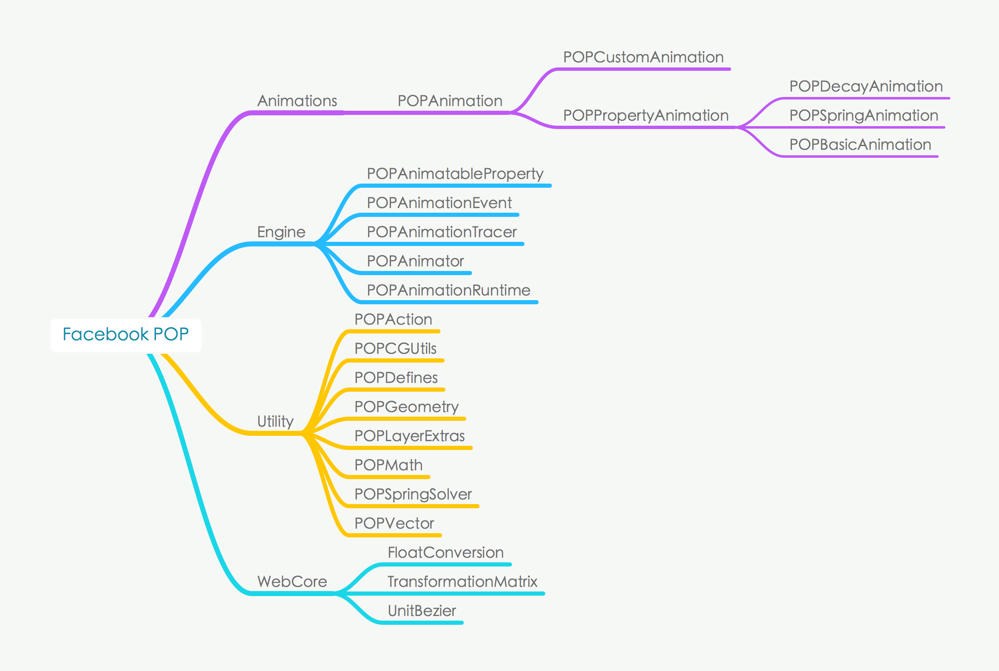
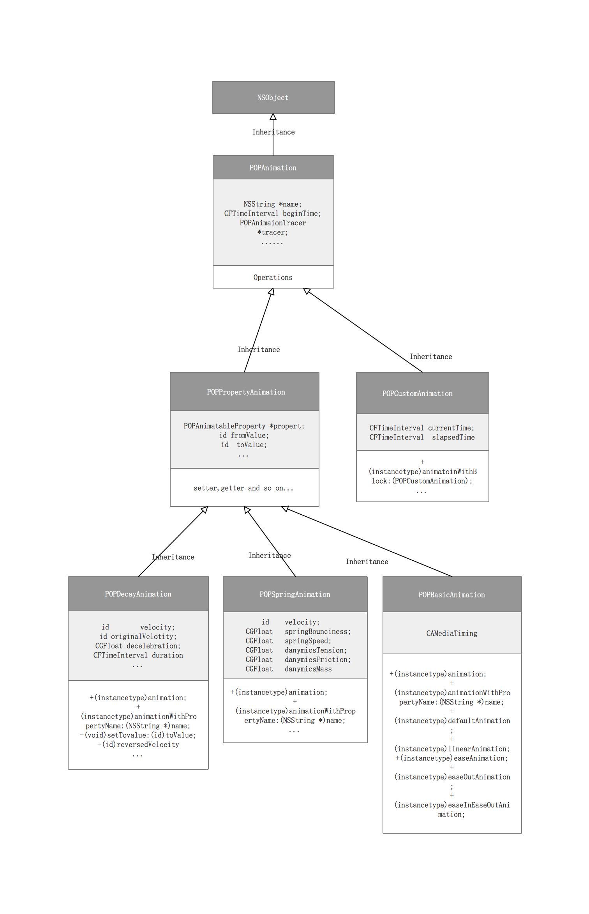

#  iOS  POP （v1.0）引擎 源码解析

## 1、类分类
POP 引擎大致框架如下图所示：

主要分为了以下四个部分。

### 1.1 动画类

重要画类大致的继承关系如下图所示

#### 1.1.1 POPAnimation
**功能：** 该类为 POP 库中所有动画类中的顶级父类，所有动画类都直接或间接的继承于它，一切动画的基础，POPAnimation 有以下重要属性：

|属性|说明|
|---|---|
|NSString *name; | name 属性是一个可选的并帮助标识该动画的属性|
|CFTimeInterval beginTime; | 动画开始时间  默认立即开始 0 |
|POPAnimationTracer *tracer;   |返回现有示踪器，如果需要，创建一个示踪器。 在示踪器上调用开始/停止来切换事件收集。  ---暂时不明白是什么意思|
|void (^completionBlock)(POPAnimation *anim, BOOL finished);    |动画完成回调  |
|BOOL removedOnCompletion;  |设置动画的 removedOnCompletion 属性值为 NO 可使得动画方便恢复，默认设置为 YES 。即动画完成之后移除掉。|
|BOOL paused|是否被暂停|
|BOOL autoreverses| 是否可逆转|
|NSInteger repeatCount|重复次数|

**协议（接口）**

|POPAnimationDelegate |接口说明|
|---|---|
|- (void)pop_animationDidStart:(POPAnimation *)anim|动画已经开始|
|- (void)pop_animationDidReachToValue:(POPAnimation *)anim|动画已经到了设定值|
|- (void)pop_animationDidStop:(POPAnimation *)anim finished:(BOOL)finished;|动画已经结束|
|- (void)pop_animationDidApply:(POPAnimation *)anim;|动画已经执行|

想要捕获到动画过程中的某一状态签订并实现上述的代理即可。

#### 1.1.1 POPPropertyAnimation  : POPAnimation 

**功能：**该类奠定了最常用的动画类 POPDecayAnimation 、POPSpringAnimation 、POPBasicAnimation 动画的基础。

|属性|说明|
|---|---|
|id fromValue | 动画属性的起始值，比如 View or layer 的 x,y,bounds,color,等等基本数据类型使用字面量的形式传入|
|id toValue | 动画属性的结果值，与 fromValue 对应 |
|CGFloat roundingFactor|指定1.0以在积分值之间动画化。 默认为0表示不舍入。**--- 暂未明确其含义，待更新**|
| NSUInteger clampMode |钳位模式应用于当前动画值。默认为 kPOPAnimationClampNone **--- 暂未明确其含义，待更新**|
| BOOL additive |指示每个帧是否应该“添加”值，而不是设置的标志。**--- 暂未明确其含义，待更新**|

#### 1.1.2 POPCustomAnimation  : POPAnimation 

较 POPAnimation 增加了如下方法和属性   
**自定义类型**   
typedef BOOL (^POPCustomAnimationBlock)(id target, POPCustomAnimation *animation);

|属性|说明|
|---|---|
|+ (instancetype)animationWithBlock:(POPCustomAnimationBlock)block | 用 Block 创建并初始化该动画实例 **--- 暂未明确其含义，待更新** |
| CFTimeInterval currentTime | 回调的当前动画时间 |
| CFTimeInterval elapsedTime | 回调的当前动画过去时长 |

动画基本用法：

#### 1.1.1 阻尼动画

	POPDecayAnimation *positionAnimation = [POPDecayAnimation animationWithPropertyNamed:kPOPLayerPosition];   
    positionAnimation.delegate = self; 
    positionAnimation.velocity = [NSValue valueWithCGPoint:velocity];
    [view.layer pop_addAnimation:positionAnimation forKey:@"layerPositionAnimation"];
    
#### 1.1.2 弹跳动画
	POPSpringAnimation *strokeAnimation = [POPSpringAnimation animationWithPropertyNamed:kPOPShapeLayerStrokeEnd];
    strokeAnimation.toValue = @(strokeEnd);
    strokeAnimation.springBounciness = 30.0f;
    strokeAnimation.removedOnCompletion = NO;
    [self.circleLayer pop_addAnimation:strokeAnimation forKey:@"layerStrokeAnimation"];  

POPBasicAnimation、POPCustomAnimation、POPDecayAnimation、POPPropertAnimation、POPSpringAnimation

### 1.2 算法及其变换类
POPMath、POPVector、TransformationMatrix、POPSpringSolver

WebCore 里包含了一些从 Apple 的开源的网页渲染引擎里拿出的源文件，与 Utility 里的组件一并，提供了 POP 的各项复杂计算的基本支持。

### 1.3 工具类
POPGeometry 、POPCGUtils、、

### 1.4 工具类

  
    
    
###3、